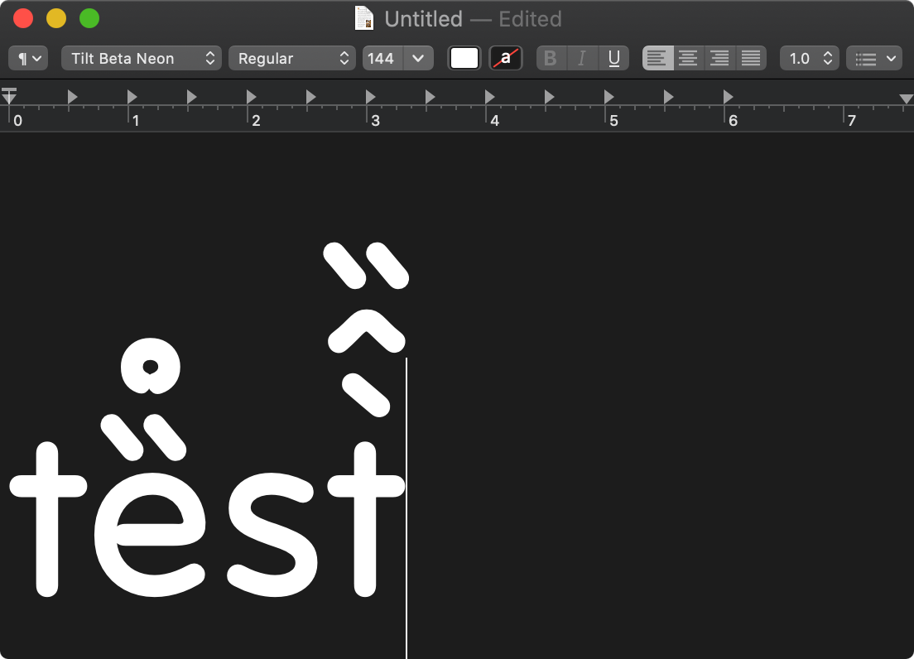

# Mark to Mark checks

*(Start at 23:10)*

With updates pulled in from the latest work in the `Develop` branch, I've built and installed new Tilt betas. 

In a very non-scientific test, it seems that mark-to-mark connections are working fairly well:

However, I'll need to find / make a more rigorous way to test these, on both mac & windows... Marc Foley has a "diffenator" tool to visually check Google Font updates, and I'll check with him tomorrow on whether/how this can be used with a new family.

## Other things to clean up

In the FontMake build process, these warnings and info messages come up multiple times:

> INFO:ufo2ft:Building OpenType tables for TiltBetaNeon-Regular
> WARNING:fontTools.pens.ttGlyphPen.TTGlyphPen:skipped non-existing component ''
> WARNING:fontTools.pens.ttGlyphPen.TTGlyphPen:skipped non-existing component ''
> WARNING:fontTools.pens.ttGlyphPen.TTGlyphPen:skipped non-existing component ''
> WARNING:fontTools.pens.ttGlyphPen.TTGlyphPen:skipped non-existing component ''
> WARNING:fontTools.pens.ttGlyphPen.TTGlyphPen:skipped non-existing component ''
> WARNING:fontTools.pens.ttGlyphPen.TTGlyphPen:skipped non-existing component ''
> WARNING:ufo2ft.fontInfoData:Underline thickness not set in UFO, defaulting to UPM * 0.05
> WARNING:ufo2ft.fontInfoData:Underline position not set in UFO, defaulting to UPM * -0.075
> WARNING:ufo2ft.fontInfoData:Underline thickness not set in UFO, defaulting to UPM * 0.05
> WARNING:ufo2ft.featureWriters.markFeatureWriter.MarkFeatureWriter:duplicate anchor 'above' in glyph 'aogonek.alt'
> WARNING:ufo2ft.featureWriters.markFeatureWriter.MarkFeatureWriter:duplicate anchor 'below' in glyph 'aogonek.alt'

- [ ] Andy should set Underline thickness & position
- [ ] One of us should check for blank-named components
- [ ] We should check for duplicate anchors and remove them in 'aogonek.alt'

*(Pause at 23:35)*